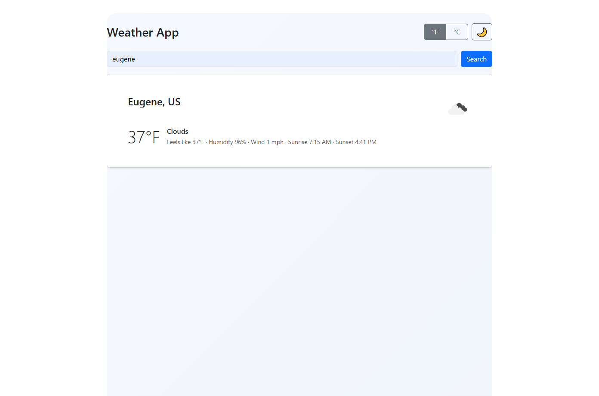
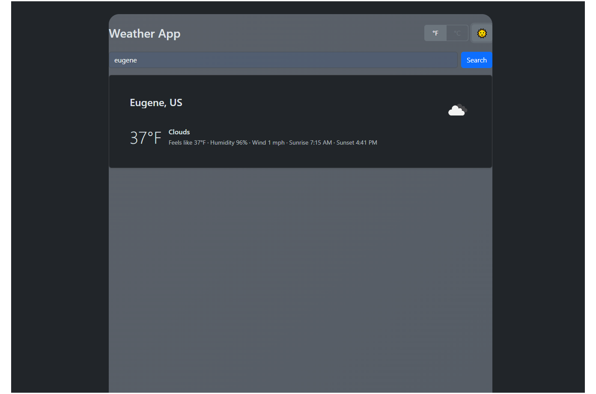
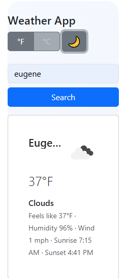

# Weather App

_A fast, responsive weather viewer built with React, Vite, Bootstrap, and the OpenWeather API._

[](https://github.com/bradysteven06/WeatherApp/actions/workflows/deploy.yml)

## Live Demo

https://bradysteven06.github.io/WeatherApp/

---

## Overview

This project is a polished weather application built with a clean React component architecture, responsive layout, and smooth UX flow. It integrates with the OpenWeather API to show current conditions, supports theme and unit toggling, and includes loading skeletons and clear error states for a professional feel.

---

## Tech Stack

- **React 19**
- **Vite 7**
- **Bootstrap 5.3**
- **Axios**
- **OpenWeatherMap API**

---

## Features

### Current Weather Display

- City, country
- Icon or emoji fallback
- Temperature, feels-like, humidity, wind
- Sunrise & sunset (automatically localized)

### Dark / Light Theme

- System-aware initial theme
- Fixed-size emoji toggle (no layout shifts)
- Smooth transitions
- Stored in localStorage

### Unit Toggle (°F / °C)

- Instant UI updates
- Refetches weather in the selected unit
- Stored in localStorage

### Dynamic Weather-Based Background

Adaptive gradients based on real conditions:

- Clear
- Clouds
- Rain / drizzle
- Snow
- Fog / mist / haze / smoke / dust
- Thunderstorms
- Night variants

### Fully Responsive Layout

- Clean spacing on mobile, tablet, and desktop
- Header controls auto-wrap for narrow screens
- Safe for very small phones (<360px width)

### Loading Skeletons

- Stable placeholder card
- No layout flicker
- ARIA-friendly

### Helpful Error States

- Invalid city -> "City not found" + tip
- Network offline -> Retry button
- Invalid/missing API key -> User-friendly service message
- Unknown failure -> fallback user message

### Lightweight Local Cache

- 10-minute per-city cache
- Reduces API calls
- Speeds up repeated searches

---

## Screenshots

```
/screenshots/
        light-desktop.png
        dark-desktop.png
        mobile.png
```

### Light Mode (Desktop)



### Dark Mode (Desktop)



### Mobile View



---

## Project Structure

```
src/
    components/
        Current.jsx
        Details.jsx
        IconBadge.jsx
        ErrorAlert.jsx
        LoadingSkeleton.jsx
        SearchBar.jsx
        ToggleUnit.jsx
        ToggleTheme.jsx
        WeatherDisplay.jsx
    services/
        weatherApi.js
    App.jsx
    App.css
    index.css
    main.jsx
```

---

## Setup Instructions

### 1. Clone the repo

```
git clone https://github.com/bradysteven06/WeatherApp.git
cd WeatherApp
```

### 2. Install dependencies

```
npm install
```

### 3. Add your OpenWeather API key

Create `.env.local`:

```
VITE_OWM_API_KEY=YOUR_API_KEY_HERE
VITE_OWM_BASE=https://api.openweathermap.org/data/2.5
```

### 4. Run the dev server

```
npm run dev
```

### 5. Build for production

```
npm run build
```

---

## Deployment

This project automatically deploys to **GitHub Pages** using the included workflow:

```
.github/workflows/deploy.yml
```

Just commit to **main** and the build will deploy to:

**https://bradysteven06.github.io/WeatherApp/**

---

## Why This Project?

This project demonstrates core front-end engineering skills:

### React State Management

- Controlled inputs
- Derived UI state
- Local storage persistence
- UI synchronization (theme, unit, loading, errors)

### API Integration

- Axios requests
- Normalized API results
- Error mapping
- Retry behavior
- Caching layer

### UI / UX Polish

- Responsive spacing system
- No layout shifts (skeletons + fixed size controls)
- Accessibility considerations
- Dynamic theme + background transitions
- Thoughtful empty, loading, and error states

### Production Ready Deployment

- Vite build pipeline
- GitHub Pages CI
- Public API usage
- Environment variables
